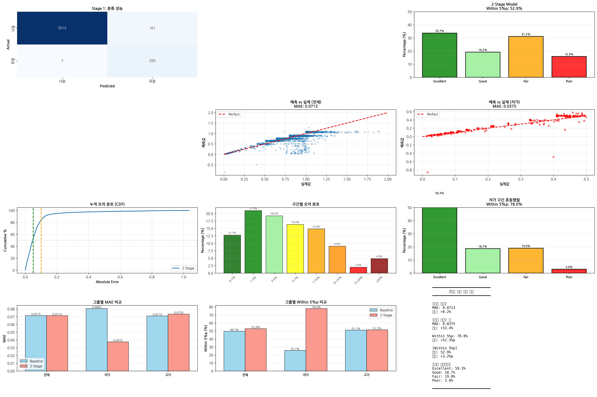
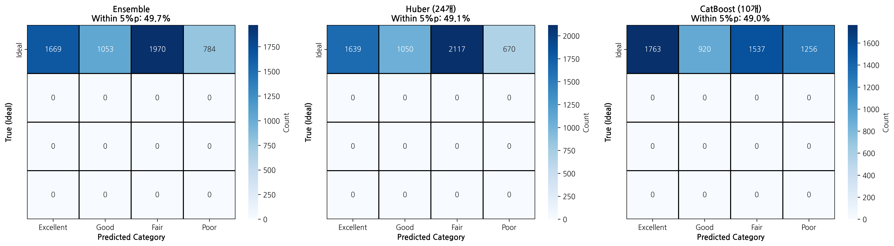
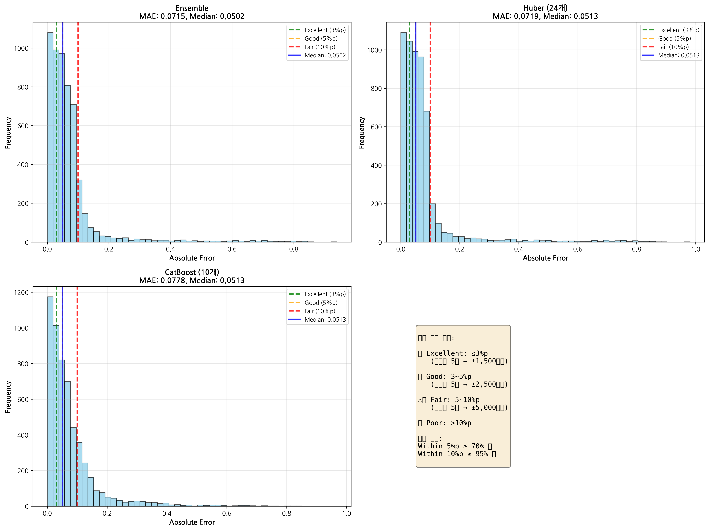
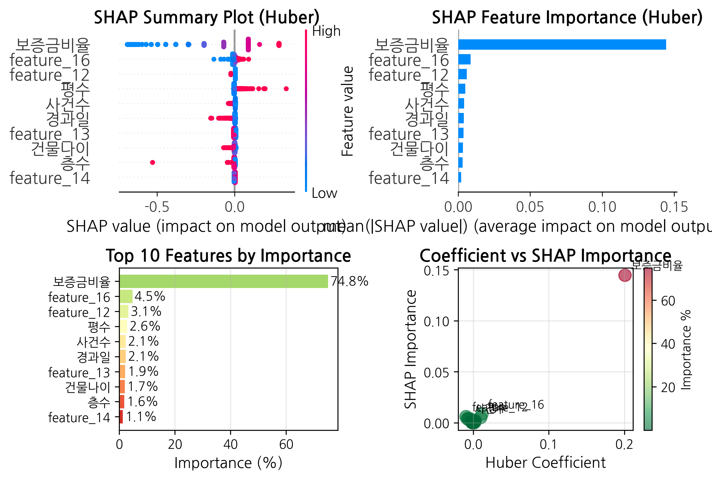

# 🏠 서울 부동산 경매 낙찰가율 예측 프로젝트

[](https://www.python.org/)
[](https://jupyter.org/)
[](LICENSE)

> **2단계 머신러닝 모델**을 활용한 서울시 부동산 경매 낙찰가율 예측 시스템

---

## 📋 목차

- [프로젝트 개요](#-프로젝트-개요)
- [주요 성과](#-주요-성과)
- [데이터셋](#-데이터셋)
- [모델 아키텍처](#-모델-아키텍처)
- [프로젝트 구조](#-프로젝트-구조)
- [설치 방법](#-설치-방법)
- [사용 방법](#-사용-방법)
- [결과 및 시각화](#-결과-및-시각화)
- [기술 스택](#-기술-스택)
- [향후 계획](#-향후-계획)

---

## 🎯 프로젝트 개요

서울시 부동산 경매 데이터를 기반으로 **낙찰가율을 예측**하는 머신러닝 프로젝트입니다.

### 핵심 특징

- **2단계 모델 아키텍처**: 분류 → 회귀의 계층적 접근
- **2020~2025년 실제 데이터**: 16,368건의 경매 낙찰 데이터
- **높은 예측 정확도**: 전체 MAE 0.0713 (Baseline 대비 49.1% 개선)
- **저가 구간 특화**: 저가 구간 MAE 53.4% 개선 (0.0805 → 0.0375)

---

## 🏆 주요 성과

### 📊 **모델 성능 요약**

```
━━━━━━━━━━━━━━━━━━━━━━━━━━━━━━━━━━━━━━━━━━━
[모델 발전 과정]
  Baseline MAE:            0.1402
  CatBoost MAE:            0.0753  (46.3% 개선)
  Huber (PyCaret) MAE:     0.0717  (48.9% 개선)
  Ensemble MAE:            0.0715  (Huber 0.8 + CatBoost 0.2)
  2단계 모델 MAE:           0.0713  (49.1% 개선) ⭐
━━━━━━━━━━━━━━━━━━━━━━━━━━━━━━━━━━━━━━━━━━━

[2단계 모델 상세]
  분류 정확도:              96.9%
  전체 MAE:                0.0713
  저가 구간 MAE:            0.0375  (53.4% 개선) ⭐
  고가 구간 MAE:            0.0733
━━━━━━━━━━━━━━━━━━━━━━━━━━━━━━━━━━━━━━━━━━━

[Within 5%p 정확도]
  전체:    52.9%  (Baseline 49.7% → +3.2%p)
  저가:    78.0%  (Baseline 25.7% → +52.3%p) ⭐
  고가:    51.5%  (Baseline 51.1% → +0.4%p)
━━━━━━━━━━━━━━━━━━━━━━━━━━━━━━━━━━━━━━━━━━━
```

### 🎯 **핵심 발견**

- **최저가율**이 전체 예측의 **74.85%** 설명력 보유 (SHAP 분석)
- 저가 구간(유찰)에서 **53.4% 성능 향상** 달성
- 2단계 접근으로 저가 물건 Within 5%p 정확도 25.7% → 78.0% 대폭 개선
- Ablation Study 결과: 24개 피처 중 4개(최저가율, 신건여부, 평당감정가, 유찰횟수)가 핵심

---

## 💾 데이터셋

### 📁 데이터 구성

| 연도 | 데이터 수 | 비율 |
| --- | --- | --- |
| 2020 | 1,281건 | 7.8% |
| 2021 | 1,341건 | 8.2% |
| 2022 | 1,331건 | 8.1% |
| 2023 | 2,016건 | 12.3% |
| 2024 | 5,058건 | 30.9% |
| 2025 | 5,341건 | 32.6% |
| **합계** | **16,368건** | **100%** |

### 📥 데이터 및 모델 다운로드

> ⚠️ **대용량 파일**: 깃허브 용량 제한으로 원본 데이터와 모델은 별도 다운로드 필요

**📊 전체 데이터셋 (17.3MB)**

- [구글 드라이브 링크](https://drive.google.com/drive/folders/1DNmNjVMLzN-vOTQWUTISFF898WrMrV7p)
- 파일명: `CSV-20260125T011313Z-1-001.zip`
- 또는 `data/` 폴더의 README 참조

**🤖 학습된 모델 파일 (13.7MB)**

- [구글 드라이브 링크](https://drive.google.com/drive/folders/1DNmNjVMLzN-vOTQWUTISFF898WrMrV7p)
- 필요 파일:
  - `2stage_classifier.pkl` (13.7MB) - Stage 1 분류 모델
  - `2stage_huber_success.pkl` (10KB) - Stage 2-1 회귀 모델
  - `2stage_huber_fail.pkl` (2KB) - Stage 2-2 회귀 모델
- 또는 `models/` 폴더의 README 참조

**📦 샘플 데이터**

- `data/sample_data.csv`: 100건 샘플 (테스트용)

### 🏷️ 주요 변수

**타겟 변수**

- `낙찰가율`: 낙찰가 / 감정가 (0.05 ~ 1.2 범위)

**주요 피처 (SHAP 중요도 순)**

- `최저가율`: 최저가 / 감정가 (중요도 74.85% ⭐)
- `동_encoded`: 위치 정보 (4.49%)
- `신건여부`: 경매 이력 (3.09%)
- `감정가`: 감정 평가 금액 (2.63%)
- `유찰횟수`: 유찰 이력 (2.13%)

---

## 🏗️ 모델 아키텍처

### 2단계 계층 구조

```
┌─────────────────────────────────────────┐
│         입력 데이터 (X)                  │
│      24개 피처, 정규화됨                 │
└─────────────────────────────────────────┘
                    │
                    ▼
┌─────────────────────────────────────────┐
│     Stage 1: RandomForest Classifier    │
│                                          │
│  입력: 24개 피처                         │
│  출력: 그룹 (0: 정상, 1: 유찰)          │
│                                          │
│  하이퍼파라미터:                         │
│  - n_estimators: 1000                   │
│  - max_depth: 15                        │
│  - class_weight: 'balanced'             │
│                                          │
│  성능: 96.9% 정확도 (Test)              │
└─────────────────────────────────────────┘
                    │
          ┌─────────┴─────────┐
          │                   │
          ▼                   ▼
┌──────────────────┐  ┌──────────────────┐
│  정상 그룹       │  │  유찰 그룹       │
│  (94.5%)        │  │  (5.5%)         │
└──────────────────┘  └──────────────────┘
          │                   │
          ▼                   ▼
┌──────────────────┐  ┌──────────────────┐
│ Huber_success   │  │ Huber_fail      │
│                  │  │                  │
│ epsilon: 1.35   │  │ epsilon: 1.1    │
│ alpha: 0.0001   │  │ alpha: 0.0001   │
│                  │  │                  │
│ MAE: 0.0733     │  │ MAE: 0.0375     │
│ (정상 그룹)      │  │ (저가 그룹) ⭐   │
└──────────────────┘  └──────────────────┘
          │                   │
          └─────────┬─────────┘
                    ▼
          ┌──────────────────┐
          │  최종 예측 결합   │
          │                  │
          │  전체 MAE: 0.0713│
          └──────────────────┘
```

### 모델 발전 과정

| 단계 | 모델 | MAE | 개선율 | 비고 |
| --- | --- | --- | --- | --- |
| 1 | Baseline | 0.1402 | - | 초기 모델 |
| 2 | CatBoost | 0.0753 | 46.3% | AutoML 실험 |
| 3 | Huber (PyCaret) | 0.0717 | 48.9% | PyCaret Tuned |
| 4 | Ensemble | 0.0715 | 49.0% | Huber 0.8 + CatBoost 0.2 |
| 5 | **2단계 모델** | **0.0713** | **49.1%** | **분류→회귀 최종** |

### 추가 실험 (딥러닝)

- Entity Embedding + Multi-Task Learning 시도
- 결과: MAE 0.0823 (-15.1% 악화) → 채택하지 않음
- 교훈: 데이터 규모(16K건)에서는 전통적 ML이 더 효과적

---

## 📂 프로젝트 구조

```
seoul-auction-prediction/
│
├── README.md
├── .gitignore
├── requirements.txt
│
├── notebooks/
│   ├── 1_서울경매_데이터수집.ipynb      # 데이터 크롤링
│   ├── 2_서울경매_전처리.ipynb          # 전처리 및 EDA
│   └── 3_서울경매_모델링_최종.ipynb     # 모델 학습 및 평가
│
├── data/
│   ├── README.md                      # 데이터 다운로드 가이드
│   └── sample_data.csv                # 샘플 데이터 (100건)
│
├── models/
│   ├── README.md                      # 모델 다운로드 가이드
│   └── .gitkeep
│
└── results/
    ├── figures/
    │   ├── 2stage_results_complete.png
    │   ├── confusion_matrices.png
    │   ├── error_distributions.png
    │   └── huber_shap_analysis.png
    └── reports/
        ├── 성능_개선_전략.md
        ├── 통계적_가설_검증.md
        └── 모델_비교_분석.md
```

---

## ⚙️ 설치 방법

### 1. 저장소 클론

```bash
git clone https://github.com/Aguantar/seoul-auction-prediction.git
cd seoul-auction-prediction
```

### 2. 가상환경 생성 (권장)

```bash
python -m venv venv
source venv/bin/activate  # Windows: venv\Scripts\activate
```

### 3. 패키지 설치

```bash
pip install -r requirements.txt
```

### 4. 데이터 다운로드

```
# data/README.md 참조하여 데이터 다운로드
# 또는 샘플 데이터로 테스트
```

---

## 🚀 사용 방법

### Jupyter 노트북으로 실행

```bash
jupyter notebook notebooks/3_서울경매_모델링_최종.ipynb
```

### Python 스크립트로 실행

```python
from src.model import TwoStageModel
from src.preprocessing import preprocess_data

# 데이터 로드
df = preprocess_data('data/sample_data.csv')

# 모델 학습
model = TwoStageModel()
model.fit(X_train, y_train)

# 예측
predictions = model.predict(X_test)

# 평가
mae = model.evaluate(X_test, y_test)
print(f"MAE: {mae:.4f}")
```

---

## 📊 결과 및 시각화

### 주요 시각화

**1. 2단계 모델 전체 결과**


**2. 혼동 행렬**


**3. 오차 분포**


**4. SHAP 분석**


### 상세 리포트

- [성능 개선 전략](results/reports/성능_개선_전략.md)
- [통계적 가설 검증](results/reports/통계적_가설_검증.md)
- [모델 비교 분석](results/reports/모델_비교_분석.md)

---

## 🛠️ 기술 스택

### 데이터 처리

- **Pandas**: 데이터 조작
- **NumPy**: 수치 연산
- **Scikit-learn**: 전처리 및 모델링

### 머신러닝

- **Scikit-learn**: RandomForest, HuberRegressor
- **CatBoost**: 대체 모델 실험
- **PyCaret**: AutoML 실험

### 시각화

- **Matplotlib**: 기본 시각화
- **Seaborn**: 통계 시각화
- **SHAP**: 모델 해석

### 개발 환경

- **Jupyter Notebook**: 인터랙티브 개발
- **Google Colab**: 클라우드 실행
- **Git**: 버전 관리

---

## 📈 향후 계획

### 단기 목표

- Streamlit 대시보드 구축
- REST API 개발
- Docker 컨테이너화

### 중기 목표

- 외부 데이터 통합 (경제 지표 등)
- 실시간 예측 시스템 구축

### 장기 목표

- 전국 확장 (서울 → 전국)

---

## 📧 문의

프로젝트에 대한 질문이나 제안사항이 있으시면 이슈를 등록해주세요.

- **GitHub Issues**: [이슈 등록하기](https://github.com/Aguantar/seoul-auction-prediction/issues)

---

**⭐ 프로젝트가 도움이 되셨다면 Star를 눌러주세요! ⭐**
